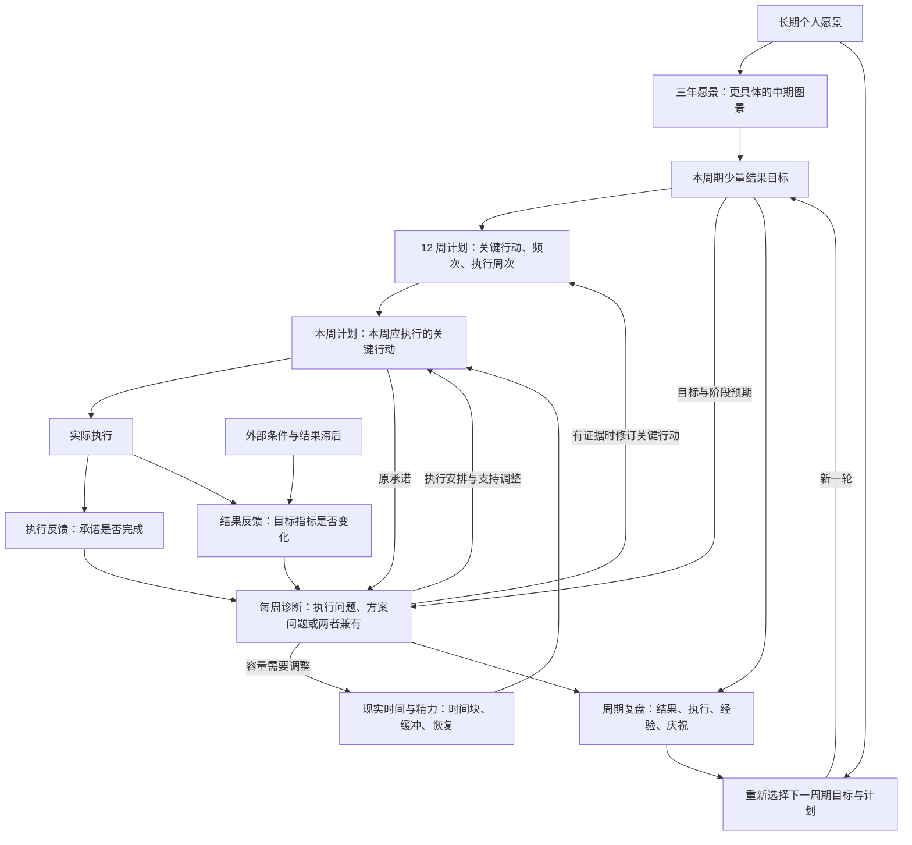

# The 12 Week Year System｜方法与闭环蓝图

版本：1.0-portable.1 · 日期：2026-09-19

身份：供产品设计引用的方法基线；可公开整理版，随规格接受审阅。

来源：Brian P. Moran、Michael Lennington，*The 12 Week Year*，Wiley，2013。

目标说明要得到什么；行动说明准备怎样实现；执行记录说明实际做了什么；结果指标说明产生了什么变化；复盘决定下一步应该保留或改变什么。

## B00｜如何使用这份基线

本文件保存共同方法，[引导协议](guidance-protocol.md)规定怎样帮助使用者作出自己的决定，[产品规格](../docs/specs/v0.1-spec.md)和[数据约定](../docs/data-contract.md)规定软件如何承载。个人目标与承诺由本人决定。

内容分为三类：

- 原著方法：按章节注明来源的原则、结构和操作。
- 作者经验建议：例如 85% 参考线和时间块长度，不是效果保证或普适定律。
- 项目约定／解释性示例：为落地作出的选择，明确标注，不能冒充原著要求。

后续设计以“蓝图版本 + Bxx → 如何承载 → 如何验证”引用，不重新复制整篇正文。软件评分边界、字段和安装流程应修订具体规格；只有方法理解或长期采用的方法改变，才修订本基线。方法升级不自动改写历史周期。

本公开版来自已整理的方法基线 v1.0；保留 B01–B10 的方法内容，移除私人项目入口和原文件路径。以后本产品的方法变更在此文件维护，不依赖外部私人文件。它不是书籍替代品，也不附带整本书。

## B01｜系统的目的、原则与五项实践

### 12 周是一轮完整的执行周期

原著针对“年度目标总觉得还有时间”的思维，缩短承诺、执行和反馈的距离。每个 12 周都作为一个有起点、目标、执行、评估与新开始的完整周期。

长期愿景仍然存在。12 周目标是向长期愿景推进的阶段结果，不能机械地把全年指标除以四，也不承诺任何目标都能压缩到原来四分之一的时间。跨越多个周期的大目标，应明确本周期能够实现的进展。

### 三项原则

| 原则 | 在系统中的含义 |
|---|---|
| Accountability｜自主承担责任 | 承认自己的选择与行动责任，主动面对现实。本人拥有目标和计划；评分与同伴支持不等于他人施加惩罚。 |
| Commitment｜承诺 | 识别真正想要的结果、关键行动和需要付出的代价，再作出愿意履行的选择。 |
| Greatness in the Moment｜当下的选择与行动 | 把长期方向落实到此刻的关键行动。成果往往晚于行动出现。 |

### 五项实践

| 实践 | 需要解决的问题 | 与其他环节的连接 |
|---|---|---|
| Vision｜愿景 | 为什么值得付出？ | 为本周期的目标与取舍提供方向和情感动力。 |
| Planning｜计划 | 要实现什么，准备采取哪些行动？ | 把愿景连接到目标、行动及其执行周次。 |
| Process Control｜过程管理 | 怎样在日常干扰中持续执行？ | 通过周计划、日常查看和每周同伴会议支持行动。 |
| Measurement｜衡量 | 是否执行了，是否有效？ | 同时观察行动执行与结果变化，为调整提供反馈。 |
| Time Use｜时间使用 | 关键行动何时发生，现实是否容纳得下？ | 把计划放入可用时间与精力，保护高价值工作和恢复。 |

这五项相互依赖：只有愿景没有行动计划，难以推进；有计划没有执行支持，容易被日常事务挤掉；有执行没有衡量，难以判断是否有效；没有时间容量，计划无法稳定发生。

来源：英文第 2、3、8–12 章。

## B02｜从愿景到结果的逻辑与反馈

以下图和概念表是对原著的结构化表达，用于后续设计沟通；它们不是 Notion 表结构。



### 概念及其关系

| 概念 | 含义 | 容易混淆的地方 |
|---|---|---|
| 人生领域 | 帮助思考生活不同方面的视角。 | 每个领域不必同时有一个活跃目标。 |
| 长期愿景 | 本人希望创造的生活与未来，原著可展望 5、10、15 年。 | 愿景不要求全部变成当前待办。 |
| 三年愿景 | 更具体的中期生活与事业图景。 | 不能直接当作本周期承诺。 |
| 12 周目标 | 在周期末希望达成、可判断的结果或阶段成果。 | “做了很多事”不能自动证明目标达成。 |
| Tactic｜关键行动 | 为实现目标选定的具体行为，包含动作、完成标准、频次或周次。 | 行动与结果之间是需要反馈检验的作用关系。 |
| 12 周计划 | 目标及其关键行动在整个周期内的安排。 | 不要求每周内容完全相同。 |
| 周计划 | 从周期计划中取出当周应执行的关键行动。 | 与全部生活、工作待办的全集不同。 |
| 执行记录 | 记录约定行动实际完成的情况。 | 排进日历、投入时间与完成行动是不同事实。 |
| 结果记录 | 记录目标指标或成果的实际变化。 | 行动完成不会让结果自动变成“已达成”。 |
| 复盘 | 对照承诺、执行和结果，决定接下来的变化。 | 只有感想而没有下一步调整，反馈尚未接回行动。 |

### 目标与行动之间的核心关系

一个目标通常需要若干关键行动；同一行动可以一次完成，也可以在多个周重复。每个纳入周期计划的关键行动，都应能解释它如何推进某个目标。

“行动能够促成目标”是一项计划假设。行动质量、频率、前后依赖、外部条件和结果出现的时间，都可能影响这项假设是否成立。因此，需要同时记录行动和结果，再检验这条联系。

后续实现可以增加“项目”“里程碑”“执行实例”等组织方式，但这些是实现层的选择。无论使用多少层，都应保留从目标追溯到行动、从行动追溯到目标的能力。

来源：英文第 3–6、13–16 章；反馈图及关系表达为本文归纳。

## B03｜如何选择与拆解目标

### 从愿景到本周期承诺

1. **明确个人意义。** 描述希望创造什么生活，以及某个结果为什么值得投入。职业或事业愿景应支持个人愿景。
2. **选择本周期最值得推进的少数结果。** 原著强调聚焦，建议一两个重点，也讨论两三个目标；只有一个目标完全可以。模板有三个空位不构成必须填满的要求。
3. **写清结果标准与期限。** 说明周期末将出现什么可观察的变化。长期目标在 12 周内不能完成时，定义有意义的阶段结果。
4. **找出现状与目标之间的差距。** 确认已有什么、缺什么，以及关键障碍。记录起点有利于之后判断变化；这是本文建议的实现方式。
5. **提出可能的行动，再选择关键少数。** 优先选择最有可能缩小差距的行动，并说明作用逻辑。尽量减少低价值动作，同时保留必要步骤。
6. **写成可执行的计划。** 为行动确定完成标准、执行周次、重复频次和责任人；理顺依赖关系。
7. **检查承诺是否成立。** 检查时间与精力是否容纳得下、愿意付出哪些代价、哪些行动最难执行，以及准备如何应对。

### 原著对目标与行动的五项写作标准

| 标准 | 检查方式 |
|---|---|
| 具体、可衡量 | 能否根据明确标准判断是否达成？数量、质量或可验收成果都需要说清楚。 |
| 正向表达 | 写希望建立的行为和结果，例如提高准确率，而非只写避免错误。 |
| 现实且有挑战 | 需要改变现有行动，但结合起点与条件仍有实现可能。 |
| 责任明确 | 个人计划由本人承担；团队目标与行动也要有明确责任人。 |
| 有时间边界 | 目标有期限，行动有执行或完成的时间安排。 |

行动还应以动词开始，写成完整、清晰的句子，并且在它到期的那一周能够按文字直接执行。“提升英语”“做好作品集”仍需进一步具体化。

本周期应有有意义的结果，必要时兼顾长期能力建设。原著商业案例中的当期收入要求不直接套用为个人生活目标。

原著第 11 章还讨论一种较轻的用法：在合适的生活领域，选择一个关键行动并作出 12 周承诺。是否需要完整、多项的行动计划，取决于目标和情境；不必为了套模板给每个领域增加同等复杂度。

来源：英文第 11、13、14、19 章。

## B04｜12 周计划怎样变成本周行动

### 周计划从周期计划产生

原著用 Week Due 标明某项行动应在哪些周执行。一项行动可能只在第 1 周发生，也可能在第 1–12 周重复。每周根据当前周期计划取出当周应执行的行动，形成周计划，再安排到具体时间。

因此，“12 周计划的一周切片”指时间归属，不意味着把目标数量平均分成十二份，也不意味着连续十二周复制同一张表。若出现新的关键行动，应回到周期计划检查和更新其依据，再反映到相应周计划。

日常沟通、行政工作和其他必做事项依然需要安排，它们占用真实容量。是否进入关键行动评分，应依据其与本周期目标的关系和事先约定的口径，不能靠多勾选杂事来提高执行分数。

### 行动定义与本周执行是两个层次

例如，“第 2–10 周，每周完成三次口语练习，每次录音并回听”是一条重复行动定义。它在第 4 周是否完成，是该行动在这一周的执行事实；第 5 周需要独立判断。

把一条重复行动永久勾选为 Done，无法表达之后各周的履约情况。具体用数据库记录、复选框或其他方式承载，可在实现设计中决定；必须能区分每周的计划与实际。

复杂工作应拆开到可执行的程度，也要避免为增加完成数量而把动作切得过碎。行动颗粒度首先服务执行和反馈，评分口径随后保持一致。

来源：英文第 5、14、15 章；“行动定义／本周执行”是本文为设计沟通作出的概念区分。

## B05｜让行动发生：时间、容量与承诺

时间安排检验计划能否真实发生。原著的 Model Week 是一张现实可行的典型周安排，用来容纳关键行动、日常职责、缓冲与恢复。纸面上都放不下的计划，需要重新取舍。

| 时间块 | 原著的作用 | 作者的典型建议 |
|---|---|---|
| Strategic Block｜战略时间块 | 不受打断地处理重要工作，可含愿景、计划检查与关键行动。 | 每周通常一个约 3 小时的时间块，优先安排在方便保护、必要时仍可重新安排的位置。 |
| Buffer Block｜缓冲时间块 | 集中处理邮件、沟通和行政事务，减少全天被零散事项打断。 | 每天一至两个，通常各 30–60 分钟，按实际工作量调整。 |
| Breakout Block｜脱离工作、恢复精力的时间块 | 暂时离开工作，通过休息和其他活动恢复。 | 系统运转良好后，每周至少约 3 小时；起步时可先按每月一次安排。 |

这些时长是作者给出的用法。具体适配应根据实际职责与生活条件说明调整理由。中文译名“突破时间块”可能引起误解：Breakout 的重点是离开工作恢复精力。

原著的承诺还要求四件事：有强烈愿望、找出关键行动、计算代价、在当下依承诺行动。代价包括放弃其他活动、舒适感和竞争性的愿望。系统应支持本人主动选择愿意承担的代价。

原著的 Intentional Imbalance 强调有意识地选择本阶段的侧重，不要求所有人生领域每周均衡投入，也不支持无限增加目标和挤满日历。

来源：英文第 7、9、11、17、19 章。

## B06｜怎样衡量：执行与结果分开

### 三类观察各自回答不同的问题

| 观察 | 回答的问题 | 解释 |
|---|---|---|
| 结果指标 Lag | 目标取得了什么进展？ | 与目标结果对应，例如验收通过的成果数量或目标状态的变化。 |
| 领先指标 Lead | 哪些更早发生的活动或进展可能推动结果？ | 根据具体目标选择。时间顺序较早不等于一定有效，也不等于完全可控。 |
| 每周执行分数 | 事先计划的关键行动完成了多少？ | 原著特别强调的一项领先反馈。衡量的是执行承诺的情况。 |

投入时间可以帮助分析容量和估时，但原著执行分数不按工时加权。“花了两小时”“完成约定练习”“达到目标能力水平”是三个不同事实。

### 原著执行评分的基本口径

```text
每周执行分数 = 本周已完成的计划关键行动项数 ÷ 本周应执行的计划关键行动项数 × 100%
```

原著第 16 章示例中，四项计划行动完成三项，执行分数为 75%。即使结果指标当周改善，分数仍然是 75%；结果改善不会补齐没执行的行动。

**评分颗粒度必须讲清楚。** 原著示例会把“每周做若干次”写为一项 tactic，以是否满足该项标准判断完成。将它拆成多条单次记录、给予部分完成分数或加权计算，都会改变计分单位或权重，不能不加说明地声称与原著示例等价。

日常记录可以细到每一次行动，而评分仍按某项周承诺汇总；是否采用这种实现，需要在具体设计里决定。

### 如何理解 85%

85% 是作者依据实践提出的执行参考：持续完成大多数关键行动，通常更有希望达到目标。原著也明确承认，65% 可能比过去进步很多，低于 85% 不等于这一周没有价值。

它不能证明计划本身正确，不能保证结果，也不能衡量一个人的价值、自律或关系中的责任。反馈的用途是帮助本人发现问题并调整。

### 原著没有替软件定义的规则

以下内容在实现评分之前必须另外明确，并标注为产品规则：

- 没有计划行动的一周显示什么；没有数据与真实的 0% 如何区分。
- 重复行动按周承诺还是按每次执行计数；部分完成如何展示与计分。
- 临时新增、取消、延期、跨周补做怎样影响分母与原周记录。
- 周计划何时确定；修改后如何保留原承诺与变更原因。
- 同一行动支持多个目标时如何避免重复计分。
- 多个目标或多周的分数如何汇总，哪些差异必须同时展示。

本方法基线列出软件需要另外决定的问题，不在方法正文中选定产品规则；当前候选规则见[数据约定](../docs/data-contract.md)。执行评分不能用一个含义不明的“所有任务完成率”替代。

来源：英文第 6、16 章；软件边界清单为本文的设计归纳。

## B07｜反馈怎样真正形成闭环

### 同时观察执行与结果，再作出判断

| 观察到的情况 | 应检查什么 | 可能的下一步 |
|---|---|---|
| 执行不足，结果也落后 | 承诺是否过量、行动是否清楚、时间是否被占用、是否缺少支持或意愿。 | 修正执行条件与安排；不能仅凭结果落后断言计划无效。 |
| 执行持续较好，结果仍落后 | 行动是否对准目标、质量和剂量是否充分、指标是否可靠、外部条件与反馈滞后是否变化。 | 有依据地修订行动方案，并确定何时再次检查效果。 |
| 执行不足，结果暂时良好 | 是否来自过去积累、外部因素或偶然变化；当前计划是否仍必要。 | 既承认结果，也继续观察，避免从一次结果推断现有执行可以长期维持。 |
| 执行与结果都良好 | 哪些行动确实有用，是否可持续，是否存在不必要负担。 | 保留有效做法，并减少没有价值的复杂度。 |

表格是在原著“区分执行问题与计划内容问题”基础上的诊断展开。它不证明单一原因，也不规定必须经过固定周数才能调整。判断需要结合行动性质、预期反馈周期与现有证据。

### 每次复盘至少接回一个后续决定——项目约定

一条可用的反馈链应能说明：

```text
原本承诺 → 实际执行与结果 → 对差距的解释 → 下一步决定 → 下次观察
```

“下周更努力”没有说清变化。更具体的表达是：“本周两次练习均被晚间工作挤掉；下周把其中一次移到周六上午，下一次周复盘检查是否执行，以及安排是否可持续。”

决定可以是保留、调整或停止。方法有效时，继续当前做法也是明确决定；每周复盘不要求每周改写计划。

执行安排的调整可以进入下一周。改变行动策略时，应同步更新周期计划。目标或个人愿景本身发生变化时，应明确重新作出选择；不能为了让分数好看而悄悄改写过去的承诺。

### 三个不同尺度的循环

| 尺度 | 核心反馈 | 主要改变什么 |
|---|---|---|
| 每日 | 今天是否按周计划推进，有何现实干扰？ | 当日安排与接下来的执行。 |
| 每周 | 上周承诺完成多少，结果如何，本周应做什么？ | 周安排、执行支持；有证据时修订周期行动。 |
| 每周期 | 达到哪些结果，哪些方法有效，下一阶段更值得投入什么？ | 下一周期的目标、计划和使用方式。 |

来源：英文第 5、6、15、16、20、21 章；三层闭环及其表达格式为本文归纳。

## B08｜日常运行与每周支持

### 启动一个周期

依次形成：个人愿景与中期方向、少量 12 周结果目标、关键行动及周次、领先与结果指标、可执行的典型周安排。检查承诺的代价与困难，准备必要支持。

### 每周固定节奏

原著第 15 章给出的顺序是：

1. **Score：评估上一周。** 核对执行分数与结果指标。
2. **Plan：计划这一周。** 从当前周期计划取出本周应执行的关键行动，并安排时间。
3. **WAM：参加每周同伴责任会议。** 交流结果、执行、困难与下一步。

每周评分与计划通常可用十几分钟完成；第 5 章也给出 15–20 分钟的周计划建议。实际所需时间视复杂度调整，重点是稳定进行。

WAM（Weekly Accountability Meeting）通常由 2–4 位伙伴参加，约 15–30 分钟。交流内容包括目前的结果、上周执行分数、本周意图，以及有帮助的经验和建议。它提供支持与反馈；责任仍由每个人自己承担。

若个人产品暂时没有同伴参与，需要把这种适配写明，并保留本人每周评分、计划和复盘的节奏。自动提醒或 AI 对话不能直接声称等价于原著的同伴支持。

### 每日节奏

原著建议每天用几分钟查看周计划，并在当天持续用它判断优先事项。当天的行动与时间安排应能回到本周关键行动；实际完成情况及时记录。

### 面对中途的困难

原著讨论改变过程中的情绪起伏：从不知困难时的乐观，进入了解困难后的悲观和低谷，再逐渐形成有经验的乐观与成就感。这是理解改变的一种模型，不用来诊断或给某个人贴标签。

出现落差时，支持本人诚实记录、检查代价、恢复行动。评分的压力可以提醒调整，但不能以羞辱和惩罚作为系统的运行基础。

来源：英文第 5、12、15、16、18、19 章。

## B09｜周期结束、学习与下一轮

第一轮有两个目标：推进本周期结果，以及学会稳定使用这套执行方法。只评价结果，会遗漏使用方法本身的学习。

原著对第一轮的节奏提示是：前四周建立基础习惯，中间四周保持投入并处理问题，最后四周继续完成关键行动。从第 2 周开始对已经结束的第 1 周评分。

第 13 周可用于总结、庆祝、恢复并准备下一轮；原著也允许必要时额外努力以完成目标。因此，不能把第 13 周解释为只能休假或无限延期。若产品采用收尾周，需明确本周期原截止点与收尾阶段取得的结果。

周期复盘应分别讨论：

- **结果**：哪些目标达成、部分达成或未达成？证据是什么？
- **执行**：哪些关键行动持续发生？主要中断在哪里？
- **方法**：哪些行动有效，哪些假设需要修正？
- **容量与体验**：时间安排、目标数量和维护负担是否可持续？
- **下一轮选择**：继续、停止或改变什么？哪些进步值得庆祝？

其中的“容量与维护负担”检查是本项目面向个人工具的补充。进入下一周期时重新作出承诺；旧的未完成事项不自动成为新周期任务。保留历史事实，使下一轮能从真实经验中学习。

来源：英文第 2、20、21 章；历史保留与重新选择事项同时遵循本项目协作约定。

## B10｜贯穿示例：从目标到反馈

以下是本文编写的假设性学习例子，用来展示逻辑，不是原著案例，也不是任何真实使用者的目标。

| 层级 | 示例内容 |
|---|---|
| 长期个人愿景 | 能独立完成分析工作，并清楚解释判断依据。 |
| 三年愿景 | 持续承担需要数据分析和表达的工作。 |
| 本周期目标 | 第 12 周结束前，完成 3 篇独立分析报告；每篇都有清晰问题、可追溯数据、可复现过程、结论与局限，并通过事先约定的验收。 |
| 行动与目标的联系 | 独立练习建立方法能力；制作报告把能力落实为成果；检查与修改暴露并修正问题。是否有效要通过产出质量检验。 |
| 一次性行动 | 第 1 周确定三个题目、可用数据和验收清单；第 3、7、11 周分别提交一篇报告初稿；第 4、8、12 周按清单检查对应报告，完成修订并记录验收结果。 |
| 重复行动 | 第 2–11 周每周针对当前报告完成两次独立分析练习，每次保留可纳入报告的过程与结论；每周对当前报告完成一次自查并记录修订。 |
| 时间支持 | 在典型周中安排练习和报告工作，同时计入必要事务与恢复。具体时长先结合现实容量估计。 |
| 结果反馈 | 已通过验收的报告数量与主要质量缺口。 |
| 执行反馈 | 当周到期的关键行动是否达到约定标准。 |

假设第 5 周有两项关键行动：“完成两次独立练习”和“完成一次报告自查与修订”。本示例选择按周行动项评分：若练习只完成一次，而自查与修订完成，执行分数为 1/2，即 50%。那一次练习仍然是真实进展，应保留记录，但不能在这个口径下将整项周承诺视为完成。

如果两项行动都完成，报告质量仍没有改善，就检查练习内容是否相关、修订是否解决关键问题、验收标准是否清楚，并考虑结果反馈是否尚未到期。不能仅凭执行分数为 100% 就判定方案正确。

这个例子中的验收清单、评分选择和成果数量都是示范性设置。后续为具体使用者设计时，应由其目标与条件决定。

## B11｜产品设计检查基线——项目约定

| 必须保留的能力 | 方法依据 | 产品承载 |
|---|---|---|
| 个人意义和自主选择 | B01、B03 | 愿景与目标由使用者确认；暂不清楚可保留未知 |
| 目标与行动可追溯 | B02–B04 | 目标、关键行动、周承诺分层 |
| 现实容量和取舍 | B05 | 本周承诺前检查可用时间、固定事务、缓冲 |
| 执行与结果独立 | B06 | 执行分数与结果观察分开，不以 Done 推断达标 |
| 反馈能回到后续决定 | B07 | 复盘记录保留／改变／停止及下次观察 |
| 连续运行与历史可解释 | B08、B09 | 每周记录、周期交接、修订原因与原承诺保留 |
| 独立使用、低维护 | 产品需求 | 每个人的结构与个人数据独立；日常少量操作 |

方法概念不等于数据库数量。具体 Notion 布局是产品选择，可在不破坏上述关系的前提下改变。当前设计是否做到这些，须按验收场景验证，不能从文档存在直接推断。

## B12｜来源、阅读边界与变更

英文依据：Brian P. Moran、Michael Lennington，*The 12 Week Year: Get More Done in 12 Weeks than Others Do in 12 Months*，Wiley，2013，ISBN 9781118616420。中文辅助对照：《超高效时间管理：用 12 周完成 12 月的工作》，刘燕译，清华大学出版社。

原始方法整理时读取了英文正文 21 章及关键图例。中文版本为图像 PDF，仅对封面、目录、系统、评分与时间安排等重点内容作视觉核对，未全文 OCR 或逐句双语审校。当前公开版沿用此前的整理，没有再次声称完成全文阅读。

| 主题 | 英文章节 |
|---|---|
| 12 周周期与愿景 | 2–4、13 |
| 三原则、五实践与完整系统 | 12 |
| 目标、行动、频次与周次 | 14；图 14.1 |
| 周计划与 WAM | 5、15；图 15.1 |
| 执行、结果与评分 | 6、16；图 16.1 |
| Model Week 与时间块 | 7、17 |
| 自主责任、承诺与取舍 | 8–11、18、19 |
| 第一轮实践与周期复盘 | 20、21 |

这是原创归纳和设计解释，不是逐句译本。作者关于效率倍增、成功概率、心理或神经机制的解释未在本项目经过独立实证核验。社交媒体个案只可补充使用体验，不能提升为原著规则或产品效果证明。

| 日期 | 版本 | 变更 |
|---|---|---|
| 2026-09-19 | 1.0-portable.1 | 从方法基线 v1.0 整理公开版本；保留方法与闭环，替换私人项目入口，增加产品引用边界。 |

技术来源与证据范围另见 [SOURCES.md](../SOURCES.md)。
