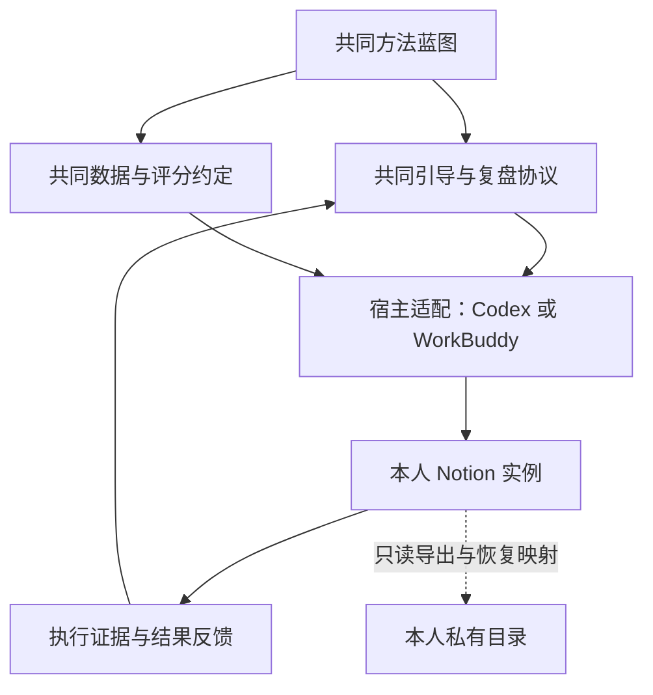

# 架构与交付边界

版本：0.1.0-review.2 · 状态：审核后修订候选。目标是两位独立使用者能运行完整闭环，后续可扩展而不先建设服务器。

## 1. 三种路径与当前选择

| 路径 | 优点 | 代价 | 结论 |
|---|---|---|---|
| 共同文件包 + Agent + 各自 Notion | 复用现有工具，数据在本人账户，容易审阅和修改 | 依赖宿主真实能力，必须有恢复与一致性规则 | v0.1 选择 |
| 本地数据库作为主库，再同步 Notion | 更容易做程序化约束和多种展示 | 同步冲突、安装与维护负担增加，周末范围过大 | 后续确有需求再评估 |
| 自建网站／Mac mini 或 VPS 服务 | 可统一界面和自动化 | 需要账号、运维、数据托管、可用性和费用管理 | 当前不做 |

选择第一条不意味着任意 Prompt 都能稳定完成安装。共同规则、稳定记录身份、能力检查和写后验证都需要后续实现与实测。

## 2. 层次与依赖方向



共同文件描述规则；使用过程产生个人答案与事实。不同使用者可运行同一版本，实例之间没有关系、共享数据库或开发者后台。个人反馈只在本人实例内优化下轮计划；若以后本人愿意分享去识别的建议，才可能形成产品变更，不能自动收集。

## 3. 当前仓库布局

```text
twelve-week-year-kit/
  README.md                   项目与当前交付说明
  AGENTS.md                   开发／审核 Agent 的执行边界
  STATUS.md                   阶段、证据与授权
  CHANGELOG.md                已发生的产品文档变更
  SOURCES.md                  来源与证据限制
  core/
    twelve-week-year-blueprint.md  共同方法基线
    guidance-protocol.md           共同引导与复盘协议
  docs/
    specs/v0.1-spec.md         需求与范围
    architecture.md           本文件
    data-contract.md          数据、评分与恢复语义
    decisions.md              确认事项、候选与未知
  checks/
    acceptance-scenarios.md   可执行的验收场景定义
  reviews/
    REVIEW_REQUEST.md         外部审核任务与报告格式
    feedback-log.md           实际反馈处理记录
```

这些是当前真实文件。以下是**未来实现后**的包边界示意，不在本阶段创建运行时空壳：

```text
release/twelve-week-year-kit-VERSION/
  START_HERE.md               给最终使用者的一页入口
  VERSION.md                 包／方法／协议／数据版本与兼容范围
  core/                      已批准共同文档
  contracts/                 已批准数据和写入规则
  adapters/codex/             宿主使用说明与能力检查
  adapters/workbuddy/         宿主使用说明与能力检查
  templates/notion/           经验证的结构与视图定义
  examples/                  仅虚构示例
  recovery/                  备份、重试、升级与退出说明
  checks/                    必要的确定性校验（实现形式待计划）
```

ZIP 是分发容器，不是 Android 安装包，不启动常驻服务。最终使用者拿到 ZIP、START_HERE 和一段简短启动提示即可；不需要阅读开发仓库全套规格。开发用 AGENTS 的“尚未实现”限制不会原样放进运行包并使产品无法启动；运行包须另有明确的使用权限边界。

templates/notion/ 只包含供安装流程在本人实例创建结构的声明式定义及必要人工视图说明，不使用开发者工作区的模板复制链接，不内嵌真实数据库或页面 ID。同一包中的角色名与字段定义由适配器绑定到本实例生成的对象。

如果宿主支持本地 Skill，可以在验证后增加薄入口；先保证普通文件包可以使用。Skill 格式一致不等于 MCP 能力或工具名称一致，不能把 Codex 的专用调用名称交给 WorkBuddy 照抄。

## 4. Notion 物理结构候选

根页面包含个人方向与四个入口：方向、本周期、本周、复盘。底层六库放在“系统数据”区域，用关系与过滤视图呈现。

| 候选数据库 | 解决的问题 | 不可混淆的概念 |
|---|---|---|
| Cycles | 周期边界与历史 | 关闭 ≠ 达成 |
| Goals | 结果与判据 | 目标 ≠ 一条任务 |
| Tactics | 重复／一次性行动定义 | 行动定义 ≠ 本周执行 |
| Commitments | 每周承诺及实际完成 | 这周完成 ≠ 以后各周完成 |
| Observations | 独立结果观察 | 行动打勾 ≠ 结果改善 |
| Reviews | 本周计划、结算、决定与周期总结 | 复盘 ≠ 自由感想 |

这是便于验证的数据分工，不是方法要求六个数据库。更少数据库加结构化正文也是可能方案，但需要证明版本、关系查询和评分可靠且没有增加用户维护；六库若不能由安装流程隐藏复杂度，也应在审核后缩减。具体属性最低内容见数据约定；本版不加习惯库、项目库、资源库或奖励库。

页面不得默认呈现全部字段。首页本周视图必须有实例／周期／周次过滤；各目标能追溯行动、结果与相关复盘。先验证核心视图和读写，再谈视觉装修。仅支持查看的宿主不足以称作完整兼容。

U02 的最低体验验收：安装完成后，常规行动记录只使用“本周”一个 Notion 入口；常规周复盘与下周确认最多使用“本周”和“复盘”两个入口，相关结果可在其中直接记录。两位试用者都无需打开“系统数据”区域、改机器标记、维护关系或 revision。记录实际经过的独立页面／视图数和 Agent 对话轮数，不能把来回跳转藏在同一个入口名称下。异常恢复与首次视图配置单列，不冒充正常日常路径；若常规路径超过门槛则 U02 未通过，先简化呈现。

## 5. 宿主适配与权限

安装能力分为必需项和可手工替代项。按实际宿主版本／连接逐项留证，API 文档存在某项功能不代表宿主 MCP 暴露它。

| 能力 | 类别 | 缺失时的处理 |
|---|---|---|
| 读取交付包、版本和指定私有恢复日志；能写入并回读获准操作日志 | 完整安装必需 | 阻断安装；可继续明确不保存的对话草稿 |
| 识别当前账号及指定根页面、校验权限范围 | 所有 Notion 读写必需 | 阻断无法校验范围的读写，不搜索别的工作区绕过 |
| 创建页面／数据库时同时写稳定标记；创建和核对关系、读取／更新／回读必要内容与版本 | 安装和相应数据操作必需 | 缺哪项就阻断依赖该项的写入；不以人工维护关系来声称完整兼容 |
| 直接读对象；在指定父位置完整分页列举安装对象，核对数据库及 data source 身份，按稳定键恢复 | 安装恢复必需 | 阻断安装兼容声明；已有实例的安全只读仍可用，但不能声称恢复通过 |
| 不对结果未知的创建盲目自动重放；可记录派发状态和错误类别 | 安装必需 | 无法核实时标未验证，不能开始可能重复的批次或声明安装兼容 |
| 设置视图、筛选与显示列 | 可手工替代 | 给具体手工步骤，完成后核对范围及 U02 路径；未经核对不算安装完整 |

这里的“完整列举”是找回对象的必要核对路径，不是事务快照或“空结果等于从未创建”的保证。分页、权限、标记可读性及工具隐藏重试都进入 U01。能力缺失可以阻断特定流程而保留安全的草稿／只读功能，但整体产品兼容声明仍须全部必需项通过。

账号和令牌由宿主或用户管理，不写入包或公开配置。仅在已连接的服务中读取最小范围；缺能力先解释具体缺口。新增账号连接由用户完成／明确授权，不能自动安装插件、读取凭证文件或切换到另一服务。

不把“全部自动”作为未经验证的承诺。发布报告注明已测试的宿主版本、系统、能力和所需人工步骤；未测环境只标未测。

## 6. 个人文件放在哪里

产品文件夹与用户选择的私有目录并列，不能把私人内容放进产品根目录再单靠 .gitignore 保护。私有目录可包含实例映射、恢复记录和日期标记的快照。正式内容仍在本人 Notion。两位使用者分别选择自己的位置；开发者不集中持有它们。

未授权 Notion 个人内容写入时，v0.1 不自动增加本地个人草稿库；提供对话中的可复制摘要，由本人下次带回。自动跨会话恢复只对已保存实例成立；未保存分支的恢复条件与限制见引导协议 P01。操作日志的写入授权也不等于个人愿景／答案的存储授权。

移动或删除产品包不会删除 Notion 记录。丢失本地映射后，从本人明确指定的根页面及其实例清单恢复；不扫描整个账号猜测实例。无法验证归属时要求本人指定正确入口。

## 7. 以后怎样演进

先稳定方法、协议和数据语义；将宿主／Notion 操作限制在适配层。若以后增加 Excel、CSV、SQLite 或网页，先决定数据主存放在哪里及迁移方式，再实现新适配，不同时开放两套可编辑主库。

外部审核之后才能编写实施计划。预期验证顺序是：宿主与记录操作可行性 → 最小闭环与恢复 → 虚构场景 → 两位独立用户的实际试用。每一步都要有可核对产物，技术假设失败应回到规格更新，不能为了完成日期扩大架构。
